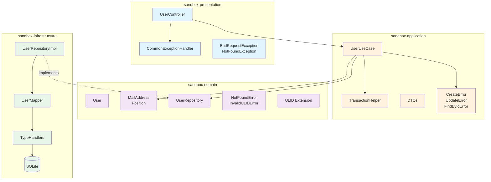
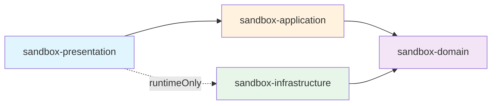
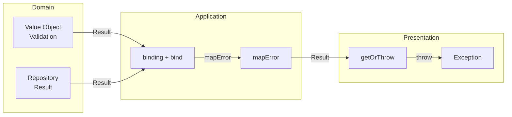

# kotlin-result-sandbox

An example application for kotlin-result.

## Architecture

```mermaid
graph TB
    subgraph Presentation["sandbox-presentation"]
        Controller[UserController]
        ExHandler[CommonExceptionHandler]
        PException[BadRequestException<br/>NotFoundException]
    end

    subgraph Application["sandbox-application"]
        UseCase[UserUseCase]
        TxHelper[TransactionHelper]
        AppDTO[DTOs]
        AppError[CreateError<br/>UpdateError<br/>FindByIdError]
    end

    subgraph Domain["sandbox-domain"]
        Entity[User]
        VO[MailAddress<br/>Position]
        RepoIF[UserRepository]
        DomainError[NotFoundError<br/>InvalidULIDError]
        Ext[ULID Extension]
    end

    subgraph Infrastructure["sandbox-infrastructure"]
        RepoImpl[UserRepositoryImpl]
        Mapper[UserMapper]
        TypeHandler[TypeHandlers]
        DB[(SQLite)]
    end

    Controller --> UseCase
    Controller --> ExHandler
    UseCase --> TxHelper
    UseCase --> RepoIF
    UseCase --> VO
    UseCase --> AppError
    RepoImpl -.implements.-> RepoIF
    RepoImpl --> Mapper
    Mapper --> TypeHandler
    TypeHandler --> DB

    classDef presentation fill:#e1f5fe
    classDef application fill:#fff3e0
    classDef domain fill:#f3e5f5
    classDef infrastructure fill:#e8f5e9

    class Controller,ExHandler,PException presentation
    class UseCase,TxHelper,AppDTO,AppError application
    class Entity,VO,RepoIF,DomainError,Ext domain
    class RepoImpl,Mapper,TypeHandler,DB infrastructure
```

## Module Dependencies

```mermaid
graph LR
    P[sandbox-presentation] --> A[sandbox-application]
    P -.runtimeOnly.-> I[sandbox-infrastructure]
    A --> D[sandbox-domain]
    I --> D

    style P fill:#e1f5fe
    style A fill:#fff3e0
    style D fill:#f3e5f5
    style I fill:#e8f5e9
```

## kotlin-result Usage Pattern

```mermaid
flowchart LR
    subgraph Domain
        VO_Validation[Value Object<br/>Validation]
        Repo_Result[Repository<br/>Result]
    end

    subgraph Application
        Binding[binding + bind]
        MapError[mapError]
    end

    subgraph Presentation
        GetOrThrow[getOrThrow]
        Exception[Exception]
    end

    VO_Validation -->|Result| Binding
    Repo_Result -->|Result| Binding
    Binding -->|mapError| MapError
    MapError -->|Result| GetOrThrow
    GetOrThrow -->|throw| Exception
```
